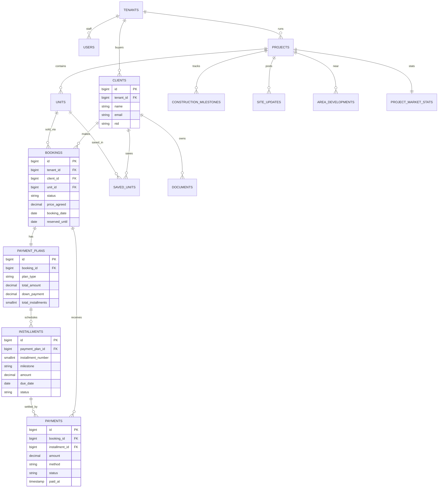

# LakeView Residences — Low-Level Design (LLD)

**Domain:** Real-estate developer/sales portal (Bangladesh apartment market)
**Stack:** Laravel 13 · Inertia.js · Vue 3 · Tailwind · MySQL
**Build target:** Demo-ready in ~6 weeks. Payments are *simulated*; all financial **math is real**.
**Today:** two portals — **Admin** (the real-estate company) and **Client** (the buyer).
**Later:** a third **Owner/SaaS** portal sits on top; the schema is already shaped for it.

---

## 1. The business, modelled correctly

In the Bangladesh apartment market the buyer's journey is: **booking → installments → handover → registration.** A buyer reserves a flat with *booking money*, pays a *down payment* (typically 20–25% of the flat price), then clears the balance through a **construction-linked payment plan** — installments tied to construction milestones (plinth, roof casting, brickwork, plastering, finishing, handover). This LLD models exactly that lifecycle.

Key domain facts baked into the design:

- A **project** is a building/development (e.g. *Lake View Residence*). The company runs many projects.
- A **unit** (flat) belongs to one project (e.g. *A-1205*, 12th floor, 2-bed).
- A **client** can own/reserve **one or many flats**, in the **same project or different projects**. This is the relationship you described, and it is handled by the `bookings` table — one client has many bookings, each booking is one flat.
- Each owned flat carries **its own** agreed price, booking/handover dates, payment plan, installment schedule, payments, and a construction-progress view (taken from its project).
- The client portal shows, per flat: price, paid vs outstanding, next installment + countdown, construction progress, and documents.

---

## 2. Actors, portals & access

| Actor | Portal | Auth guard | Scope |
|---|---|---|---|
| **Client** (buyer) | Client portal | `client` guard → `clients` table | only their own bookings/flats |
| **Company staff / admin** | Admin portal | `web` guard → `users` table | all data of their company (tenant) |
| **SaaS owner** *(later)* | Owner portal | `web` guard, `super_admin` role | all tenants (cross-company) |

**Why two separate tables (not one `users` table with a role flag):**
Buyers and staff are different domain objects with different attribute sets and lifecycles, and they log into **two physically separate portals**. A dedicated `clients` table with its own `client` auth guard gives clean separation, lets buyers carry rich attributes (NID, address, nominee) without polluting the staff table, and means an admin and a client can never collide in one identity space. This is a deliberate senior choice, not an accident.

Route grouping:
- `/admin/*` → `auth:web` + role middleware (`company_admin` | `super_admin`)
- `/portal/*` → `auth:client`

---

## 3. Multi-tenancy: dormant now, SaaS later

You asked to **skip SaaS for now but keep the door open.** The design does precisely that.

**What exists now (the only cost is one column):**
- A `tenants` table with **one row** = your real-estate company.
- A `tenant_id` foreign key on every business table.
- A single `CurrentTenant` resolver that **returns 1**. It is the *only* place tenant identity is decided.
- A `BelongsToTenant` concern (global scope) so every query is auto-filtered by tenant. (Design pattern — not shipped as a file in this package, per your request for migrations + LLD only.)

**What is NOT built now (skipped, as requested):** owner portal, tenant onboarding/signup, subscription billing, custom domains. None of it.

**Adding SaaS later is purely additive — no `ALTER` on existing tables:**
1. Change `CurrentTenant::id()` from "return 1" to "resolve from subdomain or authenticated user".
2. Add the owner portal (super_admin) + tenant onboarding + billing (Laravel Cashier + Stripe) + a `domains` table.
3. `tenants` grows from 1 row to N. Isolation already works because every query filters by `tenant_id`.

> Naming rule: it is `tenant_id` / `tenants` everywhere. `company_id` never appears.

---

## 4. Entity catalogue (with rationale)

Grouped by tier. **Tier 1** is the financial spine (build fully, real logic). **Tier 2** supports the remaining screens. **Tier 3** is optional/good-to-have.

### Tier 1 — core financial spine

**`tenants`** — the real-estate company (one row now). Future SaaS registry.
`id, name, slug, logo_path, status, settings(json), timestamps`

**`users`** — company staff/admins (and future super_admin). Guard: `web`.
Extends Laravel's default users table with: `tenant_id, role (super_admin|company_admin|staff), phone, avatar_path`.

**`clients`** — buyers. Guard: `client`. Full auth identity + buyer attributes.
`id, tenant_id, name, email, password, phone, nid (national ID), address, avatar_path, status, email_verified_at, remember_token, timestamps`

**`projects`** — a development/building the company sells.
`id, tenant_id, name, slug, location, address, description, cover_image, status (planning|under_construction|completed), total_floors, total_units, overall_progress(0-100), handover_date, latitude, longitude, timestamps`

**`units`** — a flat inside a project (the sellable asset).
`id, tenant_id, project_id, unit_number, block, floor, type, bedrooms, size_sqft, view, price, status (available|reserved|sold), handover_date, timestamps`

**`bookings`** — **the spine.** A client's claim on one unit. One client → many bookings (this is how a client owns many flats across projects).
`id, tenant_id, client_id, unit_id, status (reserved|purchased|cancelled|handed_over), price_agreed, booking_date, reserved_until, handover_date(nullable override), timestamps`
- `reserved` = booking money paid, flat held until `reserved_until`.
- `purchased` = down payment done, sale active (this is what the dashboard treats as "owned").
- `handed_over` = possession completed.

**`payment_plans`** — one plan per booking.
`id, tenant_id, booking_id, plan_type (construction_linked|equal_monthly|custom), total_amount, down_payment, start_date, handover_date, total_installments, duration_months, status, timestamps`

**`installments`** — the generated schedule rows (each "Installment 7 · BDT 75,000 · 15 Aug").
`id, tenant_id, payment_plan_id, installment_number, milestone (Booking|Under Construction|Interior Work|Handover, nullable), description, amount, due_date, status (pending|upcoming|paid|overdue), paid_at, timestamps`

**`payments`** — actual money received (simulated gateway or admin-recorded). Settles installments.
`id, tenant_id, booking_id, installment_id(nullable = ad-hoc/extra), amount, method (bkash|nagad|card|bank_transfer|cash), reference, status (pending|completed|failed), paid_at, receipt_path, notes, timestamps`

### Tier 2 — supporting screens

**`construction_milestones`** — per project (Foundation, Structure, Brick, Exterior, Interior, Landscaping, Handover).
`id, tenant_id, project_id, name, description, progress(0-100), status (completed|in_progress|pending|not_started), sort_order, estimated_date, completed_date, timestamps`

**`site_updates`** — "Latest Site Updates" + photo timeline.
`id, tenant_id, project_id, title, description, media_path, media_type (image|video), update_date, timestamps`

**`documents`** — Documents screen (metadata only for the demo — no storage binding yet).
`id, tenant_id, client_id(nullable), project_id(nullable), unit_id(nullable), title, category (legal|payments|construction|other), file_type (pdf|xls|img), file_path(nullable), file_size, status (signed|pending|verified|received|approved|latest), requires_signature, expires_at, timestamps`

**`saved_units`** — My Properties → Favorites & Compared (units a client saved but hasn't booked).
`id, tenant_id, client_id, unit_id, type (favorite|compared), timestamps` · unique(client_id, unit_id, type)

**`area_developments`** — Community & Future (nearby amenities + upcoming infrastructure + nearby projects). Seed-driven.
`id, tenant_id, project_id, kind (amenity|infrastructure|nearby_project), category (school|hospital|metro|commercial|park), name, distance_km, status (planned|upcoming|approved|under_construction), completion_date, timestamps`

**`project_market_stats`** — Investment Analyzer inputs (one row per project). Math computed in service.
`id, tenant_id, project_id, price_per_sqft, avg_rental_income, annual_expenses, best_case_return, expected_case_return, conservative_return, price_history(json), timestamps`

**`bank_partners`** — Mortgage page banking partners.
`id, tenant_id, name, logo_path, interest_rate_from, status, timestamps`

### Tier 3 — optional / good-to-have

**`kb_articles`, `ai_conversations`, `ai_messages`** — AI Property Advisor ("Sara"). See §9.
**Deferred entirely for the demo:** support tickets, real document storage, real payment gateway, notifications (use Laravel's built-in table if needed).

---

## 5. Relationships (ERD)



The path that powers the dashboard: `CLIENT → BOOKING → PAYMENT_PLAN → INSTALLMENTS`, with `PAYMENTS` settling installments and the unit's project supplying construction progress.

---

## 6. State machines

**Unit:** `available → reserved → sold` (→ on cancel, reverts to `available`).
**Booking:** `reserved → purchased → handed_over`; `→ cancelled` from reserved/purchased.
**Installment:** `pending → upcoming → paid`; `pending/upcoming → overdue` if `due_date < today` and unpaid.
**Payment:** `pending → completed` (or `failed`). Demo gateway jumps straight to `completed`.

Rule on recording a payment against an installment: mark that installment `paid` (set `paid_at`), then promote the earliest remaining `pending` installment to `upcoming`. Recompute booking totals.

---

## 7. Screen-by-screen mapping (every screenshot)

For each client screen: tables used, the **real** calculation, and the **admin** counterpart that produces the data.

### 7.1 Dashboard
- **Tables:** bookings, units, projects, payment_plans, installments, payments.
- **Calc:** total value, paid amount, paid %, outstanding, next installment + days remaining, recent payments (last 5).
- **Admin:** none directly — it is a roll-up of admin-entered data.

### 7.2 My Properties (Purchased / Reserved / Favorites / Compared)
- **Tables:** bookings (+unit+project), saved_units.
- **Calc:** completion % per flat, reservation validity countdown (`reserved_until − today`), tab counts.
- **Admin:** create a booking (assign a unit to a client), set status & `reserved_until`, set `price_agreed`, convert reserved → purchased.

### 7.3 Payments & Installments
- **Tables:** payment_plans, installments, payments.
- **Calc:** schedule generation; total vs paid installments; milestone progress bar; upcoming payment; payment history with method & receipt.
- **Admin:** build the payment plan, generate the schedule, **record payments**, attach receipts, download statement (PDF).

### 7.4 Mortgage & Financing
- **Tables:** stateless calculator; optional bank_partners.
- **Calc:** EMI, total interest, total payment, amortization series (real formula — see §8).
- **Admin:** maintain bank partners & advertised rates.

### 7.5 Investment Analyzer
- **Tables:** project_market_stats, units.
- **Calc:** gross & net rental yield, ROI projection (best/expected/conservative), capital appreciation from the seeded price series.
- **Admin:** edit per-project market stats.

### 7.6 Construction Progress
- **Tables:** construction_milestones, site_updates, projects.
- **Calc:** overall % = weighted/average of milestone progress; status roll-up (completed/in-progress/pending counts).
- **Admin:** update milestone progress %, post site updates & photos, set estimated/completed dates.

### 7.7 Community & Future
- **Tables:** area_developments, project_market_stats.
- **Calc:** amenity counts by category; future-value series.
- **Admin:** manage nearby amenities, infrastructure, nearby projects.

### 7.8 Documents
- **Tables:** documents.
- **Calc:** counts by file type, storage used (sum of file_size), pending-signature list.
- **Admin:** upload document metadata, set category & status, flag signature-required. *(Real file storage deferred.)*

### 7.9 AI Property Advisor — good-to-have (see §9)

### 7.10 Support & Help — deferred (static page for the demo)

---

## 8. Core calculations (the real business logic)

These live in `app/Services` (described here; not shipped as files in this package).

**InstallmentScheduleGenerator** — on plan creation.
- `equal_monthly`: `per = round((total - down_payment) / n, 2)`; monthly due dates from `start_date`; the final installment absorbs the rounding remainder so the sum equals `total - down_payment` exactly.
- `construction_linked`: installments carry a `milestone` label; amounts may be weighted to milestone bands (e.g. Booking / Under Construction / Interior / Handover), equal-split inside each band.

**PaymentCalculationService** — single source of truth for a booking's figures.
```
total_value       = booking.price_agreed (fallback unit.price)
total_paid        = payments.where(status='completed').sum(amount)
outstanding       = max(total_value - total_paid, 0)
paid_percent      = round(total_paid / total_value * 100, 1)
total_installments= installments.count()
paid_installments = installments.where(status='paid').count()
next_installment  = installments.whereIn(status,['upcoming','pending']).orderBy(due_date).first()
days_remaining    = next_installment ? today.diffInDays(due_date) : null
```

**MortgageCalculatorService** — matches the screenshot's BDT 148,783.
```
r = annual_rate / 12 / 100 ;  n = years * 12
EMI = P * r * (1+r)^n / ((1+r)^n - 1)
total_payment = EMI * n ;  total_interest = total_payment - P
```
Returns a yearly amortization series for the projection chart.

**InvestmentAnalyzerService**
```
gross_yield = annual_rental / price * 100
net_yield   = (annual_rental - annual_expenses) / price * 100
future_value(P, annual_return, years) = P * (1 + annual_return)^years   # 3 scenarios
appreciation% = (latest_price - first_price) / first_price * 100        # from price_history
```

**Payment simulation:** client taps Pay Now → method modal → on confirm, create a `payments` row (`status=completed`, fake `reference`) and run `PaymentCalculationService`. Admin "record payment" is the same operation. A real gateway later sits behind one method — no schema change.

---

## 9. Good-to-have: AI Property Advisor ("Sara")

A demo-friendly, retrieval-light design — no fine-tuning or vector DB needed initially.

1. **Quick-question chips** ("How much do I still owe?", "When is my next payment?") map to **deterministic handlers** that return real numbers straight from `PaymentCalculationService`. Instant, always correct, zero LLM cost. These alone make the feature look smart.
2. **Free-text questions** → build a prompt = system instructions + the logged-in client's financial snapshot (JSON) + top-k `kb_articles` matched by keyword/LIKE + the question → call an LLM (Claude/OpenAI) server-side. Persist turns in `ai_conversations` / `ai_messages`.
3. **Grounding & safety:** inject only the authenticated client's own data (respect `tenant_id` + ownership); instruct the model to answer only from supplied context; keep the visible "Sara can make mistakes" disclaimer.
4. **Upgrade path:** start with keyword KB matching; move to embeddings/vector search only if needed post-demo.

Fits the timeline because the high-value path is deterministic; the LLM wrapper is added last and degrades gracefully.

---

## 10. Build plan (6 weeks)

| Week | Deliverable |
|---|---|
| 1–2 | Setup; dual-guard auth (`web` + `client`); **migrations + seeders**; `BelongsToTenant`; calculation services + tests |
| 3–4 | Client portal: Dashboard, Payments & Installments, My Properties, Mortgage, Investment (real calc on seed data) |
| 5 | Admin portal: projects/units, clients, bookings, plan builder, **record payment**, construction & documents |
| 6 | Construction/Community/Documents polish; PDF statement (`barryvdh/laravel-dompdf`); PWA wrap; demo data; dry run |

---

## 11. Indexing & integrity notes
- `tenant_id` indexed on every table (and combined with the most common filter, e.g. `(tenant_id, status)`).
- `bookings (tenant_id, client_id, status)` — drives My Properties & dashboard.
- `installments (tenant_id, payment_plan_id, status)` — drives schedule + next-due lookups.
- `payments (tenant_id, booking_id, status)` — drives totals.
- FKs cascade on tenant/parent delete; `payments.installment_id` is `nullOnDelete` (ad-hoc payments survive).
- Status/type fields are plain strings with documented allowed values (cheap to evolve; no enum-alter pain).

---

## 12. Explicitly out of scope for the demo (by request)
- SaaS owner portal, tenant onboarding, subscription billing — designed for, not built.
- Real document file storage — metadata only.
- Support & Help tickets — static page.
- Real payment gateway — simulated.
